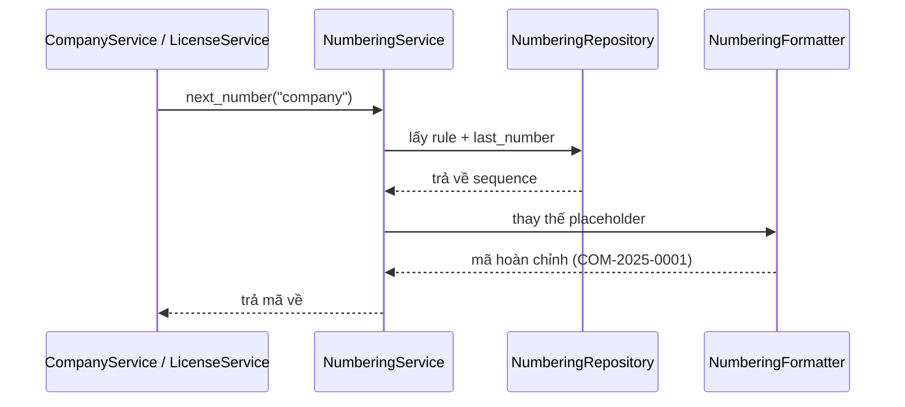

# Core/Numbering Module

Module **Numbering** chịu trách nhiệm quản lý việc **đánh số tự động (auto-increment code)** cho các entity như **Company, Customer, Contact, Quote, License**.  
Đảm bảo mỗi record có một mã duy nhất, theo quy tắc cấu hình được trong **Settings**.

---

## 1. Mục đích & Chức năng chính

1. **Sinh số tự động**  
   - Mỗi entity (Company, Customer, Quote, License, …) có một quy tắc numbering riêng.
   - Format có thể chứa các placeholder:  
     - `{prefix}`: tiền tố (ví dụ: CUS, COM, QUO).  
     - `{yyyy}`: năm 4 chữ số.  
     - `{yy}`: năm 2 chữ số.  
     - `{mm}`: tháng.  
     - `{dd}`: ngày.  
     - `{seq}`: số thứ tự tăng dần, có padding.  

   Ví dụ: `CUS-{yyyy}-{seq}` → `CUS-2025-0001`

2. **Reset sequence**  
   - Có thể reset theo **năm**, **tháng**, hoặc **không reset**.  
   - Ví dụ: `QUO-{yy}{mm}-{seq}` → `QUO-2509-0001` (reset mỗi tháng).

3. **Tùy biến theo module**  
   - Module khi tạo record mới sẽ gọi sang **NumberingService** để xin số tiếp theo.  
   - Module không cần tự quản lý sequence.

4. **Cấu hình trong Settings**  
   - Admin có thể thay đổi format cho từng loại record trong trang **Cài đặt → Đánh số tự động**.  
   - Ví dụ:  
     - Company: `COM-{yyyy}-{seq}`  
     - Customer: `CUS-{yyyy}-{seq}`  
     - Quote: `QUO-{yy}{mm}-{seq}`  
     - License: `LIC-{yy}{mm}-{seq}`

---

## 2. Cấu trúc thư mục

```text
src/Core/Numbering/
   ├── Application/
   │     └── NumberingFacade.php
   ├── Domain/
   │     ├── DTO/NumberingRuleDTO.php
   │     └── Services/NumberingService.php
   ├── Infrastructure/
   │     ├── Installer.php
   │     └── WpdbNumberingRepository.php
   ├── Presentation/Admin/Settings/
   │     └── NumberingSettingsIntegration.php
   ├── NumberingModule.php   # bootstrap (file chính)
   └── NumberingServiceProvider.php
```

- **NumberingService**: API nội bộ `next_number($entity_type)` sinh mã.  
- **NumberingFacade**: API tĩnh cho module khác gọi nhanh.  
- **Repository (WpdbNumberingRepository)**: lưu rule + sequence trong DB.  
- **Installer**: tạo bảng `tmt_crm_numbering_rules`.  
- **SettingsIntegration**: hiển thị form config trong trang Settings.  
- **Module & ServiceProvider**: bootstrap và bind DI.

---

## 3. Flow hoạt động

1. Module (vd: `CompanyService`) gọi:  
   ```php
   $code = NumberingFacade::next_number('company');
   ```

2. **NumberingService** kiểm tra rule trong Repo.  
   - Nếu chưa có → seed từ Settings.  
   - Nếu có → lấy rule (prefix, suffix, padding, reset).

3. Repo tăng `last_number` (atomic update trong DB).  

4. **NumberingService** + **Formatter** thay thế placeholder → trả về mã đầy đủ.  

5. Module gán mã vào DTO rồi insert DB.  

---

## 4. Các cách gọi

### A. Gọi qua Facade (ngắn gọn – đề xuất)
```php
use TMT\CRM\Core\Numbering\Application\NumberingFacade;

$code = NumberingFacade::next_number('license');
```

- Phù hợp cho hầu hết module.  
- Ưu điểm: code gọn, ít phụ thuộc.  
- Nhược: khó mock hơn khi test unit.

### B. Gọi trực tiếp Service (testable hơn)
```php
use TMT\CRM\Core\Numbering\Domain\Services\NumberingService;

final class LicenseService
{
    public function __construct(
        private LicenseRepositoryInterface $repo,
        private NumberingService $numbering
    ) {}

    public function create(LicenseDTO $dto): int
    {
        if (empty($dto->code)) {
            $dto->code = $this->numbering->next_number('license');
        }
        return $this->repo->insert($dto);
    }
}
```

- Dùng khi cần mock NumberingService trong test.  
- Yêu cầu khai báo dependency trong constructor.

---

## 5. Chính sách reset

- **never**: không reset.  
- **yearly**: reset khi sang năm mới.  
- **monthly**: reset khi sang tháng mới.  

**Token khả dụng trong prefix/suffix:**
- `{year}` → 2025  
- `{yy}` → 25  
- `{month}` → 09  
- `{day}` → 30  

**Ví dụ:**  
- Prefix: `LIC-{yy}{month}-`  
- Padding: `5`  
- Reset: `monthly`  

Kết quả:  
- Tháng 09/2025 → `LIC-2509-00001`  
- Tháng 10/2025 → `LIC-2510-00001`

---

## 6. Best Practices

- Chỉ **Service nghiệp vụ** quyết định sinh mã (nếu `$dto->code` trống).  
- Không sinh mã ở Controller hay Presentation.  
- DB cột `code` nên có **UNIQUE KEY**.  
- Với môi trường concurrency cao → thêm vòng **retry** nếu insert trùng.  
- Mỗi class nên chọn **1 cách gọi** (Facade **hoặc** DI Service), không trộn lẫn.  
- Sau khi thêm entity mới cần numbering:  
  - Bổ sung field config trong `NumberingSettingsIntegration`.  
  - Gọi `NumberingFacade::next_number('entity')` trong service.  
- Luôn chạy `composer dump-autoload -o` sau khi thêm/sửa file.

---

## 7. Troubleshooting

- **Không thấy tab “Đánh số tự động”**:  
  - Quên gọi `NumberingSettingsIntegration::register()`.  
  - Dùng nhầm cơ chế Tab cũ thay vì SettingsRegistry.  
  - Chưa chạy `composer dump-autoload -o`.

- **Fatal: Service not found …Interface**:  
  - Sai namespace Interface (`TMT\CRM\Domain\Repositories\NumberingRepositoryInterface`).  
  - Chưa bind trong `NumberingServiceProvider`.

- **Mã trùng**:  
  - Thiếu UNIQUE ở DB.  
  - Race condition chưa xử lý retry.

---

## 8. Kế hoạch mở rộng

- Hỗ trợ nhiều sequence khác nhau trong cùng một entity (vd: Invoice nội địa vs xuất khẩu).  
- Reset theo quý (Q1, Q2, Q3, Q4).  
- Xem lại log sequence đã cấp.


